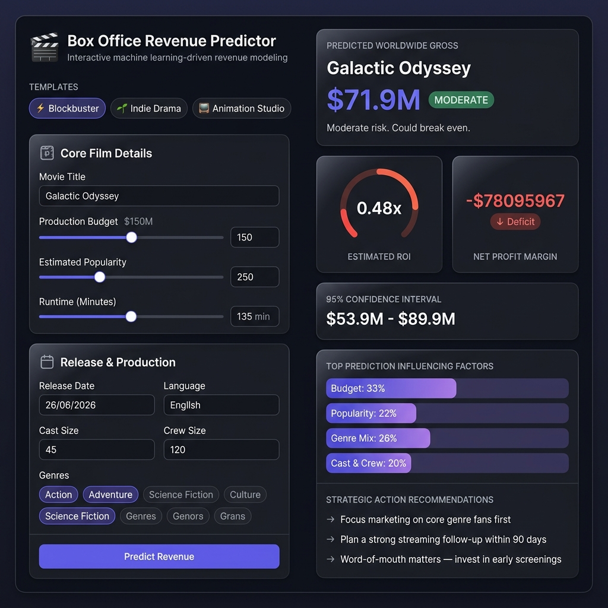

# Box Office Revenue Prediction

A machine learning-powered web application for predicting movie box office revenue based on various film attributes and historical data.

## Description

This project implements an end-to-end solution for box office revenue prediction using advanced machine learning techniques. It features a FastAPI backend that serves predictions via RESTful APIs and an interactive HTML frontend for user interaction. The system analyzes movie features such as budget, popularity, runtime, release date, genres, and cast/crew information to provide accurate revenue forecasts with confidence intervals.

## UI Preview



> A split-pane analytics dashboard: configure your film parameters on the left and get instant ML-driven revenue predictions with ROI gauge, confidence intervals, and strategic recommendations on the right.

## Features

- **Machine Learning Models**: Trained XGBoost and ensemble models for high-accuracy predictions
- **Real-time Predictions**: FastAPI backend for instant revenue forecasting
- **Interactive Frontend**: User-friendly web interface for inputting movie details
- **Confidence Intervals**: Provides prediction ranges and ROI calculations
- **Feature Engineering**: Advanced preprocessing and feature extraction from movie data
- **Data Visualization**: Jupyter notebook for exploratory data analysis

## Tech Stack

- **Backend**: Python, FastAPI, scikit-learn, XGBoost, joblib
- **Frontend**: HTML, CSS, JavaScript
- **Data Processing**: pandas, numpy
- **Machine Learning**: Random Forest, Gradient Boosting, Stacking Regressor
- **Deployment**: Uvicorn

## Installation

### Prerequisites

- Python 3.8+
- pip

### Backend Setup

1. Clone the repository:
   ```bash
   git clone https://github.com/safalT1/Box_Office_Revenue_Prediction.git
   cd Box_Office_Revenue_Prediction
   ```

2. Install dependencies:
   ```bash
   cd backend
   pip install -r requirements.txt
   ```

3. Ensure model files are in place:
   - `models/best_box_office_model.pkl`
   - `models/preprocessor.pkl`
   - `models/feature_engineer.pkl`
   - `models/feature_columns.json`

### Frontend Setup

The frontend is a static HTML file located in the `frontend/` directory. No additional setup required.

## Usage

### Running the Backend

1. Navigate to the backend directory:
   ```bash
   cd backend
   ```

2. Start the FastAPI server:
   ```bash
   python run.py
   ```

   The API will be available at `http://localhost:8000`

### Accessing the Frontend

Open `frontend/index.html` in a web browser to use the prediction interface.

### API Endpoints

#### POST /predict
Predict box office revenue for a movie.

**Request Body:**
```json
{
  "movie": {
    "budget": 100000000,
    "popularity": 50.0,
    "runtime": 120,
    "release_year": 2024,
    "release_month": 7,
    "release_day": 15,
    "original_language": "en",
    "genre_count": 3,
    "companies_count": 2,
    "countries_count": 1,
    "languages_count": 1,
    "cast_count": 50,
    "crew_count": 100,
    "genres": ["Action", "Adventure", "Sci-Fi"]
  }
}
```

**Response:**
```json
{
  "predicted_revenue": 500000000,
  "confidence_low": 450000000,
  "confidence_high": 550000000,
  "roi": 4.0,
  "category": "Blockbuster",
  "message": "High confidence prediction"
}
```

## Project Structure

```
Box_Office_Revenue_Prediction/
├── backend/
│   ├── app.py              # FastAPI application
│   ├── feature_engineer.py # Feature engineering logic
│   ├── run.py              # Server startup script
│   ├── requirements.txt    # Python dependencies
│   └── models/             # Trained models and artifacts
├── frontend/
│   └── index.html          # Web interface
├── Notebook/
│   └── BOC.ipynb           # Data analysis and model training
├── extract_class.py        # Data extraction utilities
└── README.md               # Project documentation
```

## Data Analysis

The `Notebook/BOC.ipynb` contains the complete data science workflow including:
- Data exploration and visualization
- Feature engineering
- Model training and evaluation
- Hyperparameter tuning
- Performance metrics analysis

## Contributing

1. Fork the repository
2. Create a feature branch (`git checkout -b feature/AmazingFeature`)
3. Commit your changes (`git commit -m 'Add some AmazingFeature'`)
4. Push to the branch (`git push origin feature/AmazingFeature`)
5. Open a Pull Request

## License

This project is licensed under the MIT License - see the LICENSE file for details.

